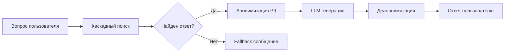

# 🚀 Быстрый старт: RAG для FAQ Bot

## За 5 минут

### 1. Установите зависимости

```bash
pip install natasha openai
```

### 2. Получите OpenRouter API ключ

1. Зарегистрируйтесь: [https://openrouter.ai/](https://openrouter.ai/)
2. Пополните баланс ($5 минимум) или используйте бесплатную модель
3. Создайте ключ: [https://openrouter.ai/keys](https://openrouter.ai/keys)

### 3. Настройте .env

```env
# Включить RAG
RAG_ENABLED=true

# Вставьте ваш ключ
OPENROUTER_API_KEY=sk-or-v1-xxxxxxxxxxxxxxxxxxxxxxxxx

# Выберите модель (рекомендуется для старта)
OPENROUTER_MODEL=openai/gpt-4o-mini

# Или бесплатная модель для тестирования
# OPENROUTER_MODEL=google/gemini-2.0-flash-001
```

### 4. Протестируйте

```bash
python scripts/test_rag_pipeline.py
```

Вы должны увидеть:

```
✓ Анонимизация: Email, телефоны, имена → [EMAIL_1], [PHONE_1], [PER_1]
✓ LLM генерация: Успешно
✓ Деанонимизация: Данные восстановлены
```

### 5. Запустите бота

**Telegram:**
```bash
python -m src.bots.bot
```

**Bitrix24:**
```bash
python -m src.bots.b24_bot
```

---

## Что дальше?

- 📖 Полная документация: [`docs/RAG_GUIDE.md`](./RAG_GUIDE.md)
- ⚙️ Тонкая настройка: измените `RAG_TEMPERATURE`, `RAG_MAX_TOKENS` в `.env`
- 💰 Оптимизация затрат: используйте `gpt-4o-mini` или бесплатный `gemini-2.0-flash-001`

---

## Рекомендуемые модели

| Модель | Цена | Качество | Для чего |
|--------|------|----------|----------|
| `google/gemini-2.0-flash-001` | **БЕСПЛАТНО** | ⭐⭐⭐⭐ | Тестирование |
| `openai/gpt-4o-mini` | $0.15/$0.60 за 1M | ⭐⭐⭐⭐⭐ | **Продакшн** |
| `openai/gpt-4o` | $2.50/$10.00 за 1M | ⭐⭐⭐⭐⭐ | Премиум качество |

---

## Как это работает?



**Пример:**

```
👤 Вопрос: "Как связаться с бухгалтерией?"

🔍 Поиск → Найдено: "Бухгалтерия: Мария Петрова, +7 495 123-45-67"

🔒 Анонимизация → "Бухгалтерия: [PER_1], [PHONE_1]"

🤖 LLM генерация → "Свяжитесь с [PER_1] по [PHONE_1]"

🔓 Деанонимизация → "Свяжитесь с Марией Петровой по +7 495 123-45-67"

✅ Ответ пользователю
```

---

## Отключение RAG

Если нужно вернуться к обычному поиску:

```env
RAG_ENABLED=false
```

---

## Помощь

- ❓ Вопросы: см. [`docs/RAG_GUIDE.md`](./RAG_GUIDE.md) раздел FAQ
- 🐛 Проблемы: раздел Troubleshooting в документации
- 📝 Примеры: [`scripts/test_rag_pipeline.py`](../scripts/test_rag_pipeline.py)
